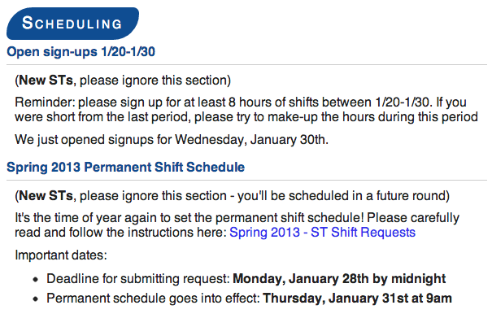

Casey's custom css for Markdown-Here http://markdown-here.com/



### Setup
Go to the settings page for the markdown-here Chrome Extension.
In the field "primary styling", paste-append the contents of the file `default.css` in this repo.

### Markdown-Here Updates
Markdown-here periodically updates their css to be more cross-browser compatible and standard. I put my overrides at the bottom of their default styling, but there may be conflicts - double-check it looks how you'd like before sending :)

### Troubleshooting
If something looks funny, try their default first and then try these additions one at a time.

### Cross-Client Compatibilitiy
This css is primarily targeted at gmail users (like the students at Yale university). The rounded-borders headers that look so sleek don't work in every email client.

### Example code to test with

```
Hello my friend,

# Header 1

Some intro text

## Header 2

Yes this is more text

- bullet 1
- bullet 2
- bullet 3

# Header 1

Some intro text

## Header 2

Yes this is more text

- bullet 1
- bullet 2
- bullet 3


-- 
signature gets outdented again
when it starts with --
Casey Watts!
```
